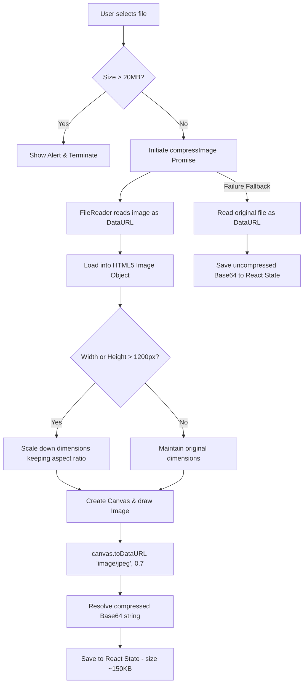

# Technical Specification: Nibras Supervisor Dashboard

This document provides a highly detailed, comprehensive technical specification of the Nibras Supervisor Dashboard system. It is designed to serve as a complete reference for developers and AI agents maintaining, extending, or replicating this system.

---

## 1. System Architecture & Directory Map

The dashboard is integrated directly into the unified Nibras Next.js codebase. The directory structure is mapped as follows:

```
Nibras/
├── app/
│   ├── api/
│   │   ├── register/
│   │   │   └── route.ts            # Public registration API
│   │   └── supervisor/             # Supervisor Dashboard REST APIs
│   │       ├── announcements/
│   │       ├── attendance/
│   │       ├── auth/
│   │       │   ├── login/
│   │       │   ├── logout/
│   │       │   └── me/
│   │       ├── groups/
│   │       ├── points/
│   │       ├── settings/
│   │       └── students/           # Student CRUD and state modifications
│   ├── register/
│   │   └── page.tsx                # Public 2-step registration & payment UI
│   └── supervisor/                 # Frontend dashboard views
│       ├── (dashboard)/            # Dashboard layouts and sub-pages
│       │   ├── announcements/
│       │   ├── attendance/
│       │   ├── groups/
│       │   ├── layout.tsx          # Navigation sidebar & layout structure
│       │   ├── page.tsx            # Main analytics homepage
│       │   ├── payments/
│       │   ├── points/
│       │   ├── settings/           # System text & bank account configurations
│       │   ├── students/           # Interactive Student Directory & Modals
│       │   └── supervisors/
│       └── login/
│           └── page.tsx            # Authentication login screen
├── lib/
│   ├── auth.ts                     # Session token signature & verification
│   └── services.ts                 # Storage Layer (Prisma Database & File DB Fallback)
└── prisma/
    └── schema.prisma               # Prisma models and DB constraints
```

---

## 2. Database Schema (Prisma Models)

The data models used by the Supervisor Dashboard are declared in `prisma/schema.prisma`. 

```prisma
model Registration {
  id                 Int       @id @default(autoincrement())
  membershipNo       Int       @unique
  studentName        String
  nationalId         String
  guardianPhone      String
  studentPhone       String?
  stage              String    // 'ابتدائي' | 'متوسط' | 'ثانوي'
  grade              String    // Grade relative to the stage
  neighborhood       String
  locationLat        Float?
  locationLng        Float?
  mapLink            String?   // Pasted Google Maps link
  hasCondition       Boolean   @default(false)
  conditionNote      String?   // Health issues / Allergies
  createdAt          DateTime  @default(now())
  paymentStatus      String    @default("unpaid") // 'paid' | 'unpaid'
  paymentType        String    @default("later")  // 'now' (Immediate) | 'later' (Deferred)
  paymentReceipt     String?   // Base64-encoded compressed image string
  groupId            Int?      // Mapped to Group
  registrationStatus String    @default("pending") // 'pending' | 'approved' | 'rejected'
}

model Supervisor {
  id       Int    @id @default(autoincrement())
  name     String
  email    String @unique
  password String // Hashed or plain (strictly compared in services)
  role     String // 'admin' (Full Control) | 'supervisor' (Limited scoping)
  groupIds String // Comma-separated list of Group IDs, e.g. "1,2,5"
}

model Group {
  id    Int    @id @default(autoincrement())
  name  String
  stage String
}

model Setting {
  key   String @id
  value String
}
```

### Hybrid Storage Layer
In `lib/services.ts`, the database layer checks for the presence of the `DATABASE_URL` environment variable:
- **Database Active**: Connects directly to Neon PostgreSQL using Prisma Client.
- **Fallback Active**: Reads and writes to local JSON files stored under the `.data/` directory (e.g., `.data/registrations.json`).
- **Default Seed**: Automatically inserts an administrator account on boot if no supervisors exist:
  - **Email**: `admin`
  - **Password**: `12345`
  - **Role**: `admin`

---

## 3. Session Authentication & Role Security

The system implements a custom stateless session validation framework using standard HTTP-only cookies.

### Cryptographic Token Validation (`lib/auth.ts`)
- **Login**: Compares raw supervisor credentials. If matches, generates a JSON payload:
  `{ "email": supervisor.email, "role": supervisor.role, "exp": Date.now() + 24 * 60 * 60 * 1000 }`
- **Signing**: The JSON string is appended with a SHA-256 HMAC signature using a server-side secret key, stored as a base64 cookie named `session`.
- **Validation**: Every backend API endpoint parses the `session` cookie, verifies the cryptographic signature, checks the expiration, and extracts the supervisor's details.

### Scoping Rules
1. **Administrative Operations**:
   - Only accounts with `role === 'admin'` can call `DELETE` on `/api/supervisor/students`.
   - Only `admin` accounts can modify system settings (`/api/supervisor/settings`).
2. **Supervisor Data Scoping**:
   - Accounts with `role === 'supervisor'` have their `groupIds` string parsed:
     `const allowedIds = supervisor.groupIds.split(',').map(id => parseInt(id.trim(), 10))`
   - When calling `GET` on `/api/supervisor/students`, only students whose `groupId` is within `allowedIds` are returned.
   - When calling `PUT` on `/api/supervisor/students`, supervisors cannot edit records of students who do not belong to their groups.

---

## 4. REST APIs Specs (`app/api/supervisor/`)

All requests must contain a valid session cookie. Responses return standard JSON formats.

### Student Management API (`/api/supervisor/students`)

#### GET
Fetches the registry.
- **Query Parameters**:
  - `search` (String): Match name, national ID, phone, membership No.
  - `stage` (String): Filter by school stage.
  - `neighborhood` (String): Filter by neighborhood.
  - `paymentStatus` (String): `paid` | `unpaid`.
  - `registrationStatus` (String): `pending` | `approved` | `rejected`.
  - `groupId` (String): Filter by Group ID.
- **Response**:
  ```json
  {
    "students": [
      {
        "id": 1,
        "membershipNo": 10001,
        "studentName": "Ahmad Mohammad",
        "nationalId": "1029384756",
        "guardianPhone": "0501234567",
        "paymentType": "now",
        "paymentReceipt": "data:image/jpeg;base64,...",
        "paymentStatus": "unpaid",
        "registrationStatus": "pending"
      }
    ]
  }
  ```

#### PUT
Updates student attributes. The endpoint supports partial merging to ensure that sending single keys (e.g. just updating `paymentStatus`) does not overwrite unchanged parameters (such as `paymentReceipt` or `studentName`) with `undefined`.
- **Payload**:
  ```json
  {
    "id": 1,
    "paymentStatus": "paid"
  }
  ```
- **Response**:
  ```json
  {
    "success": true,
    "student": { ...updatedStudentDetails }
  }
  ```

#### DELETE
Deletes a student record.
- **Query Parameter**: `id` (integer ID of registration)
- **Response**: `{ "success": true }`

---

## 5. UI Views & Front-end Layouts

The frontend matches Nibras' branding guidelines: Light-beige warm backgrounds (`#F9F6F0`), high-contrast brutalist borders, and the custom `Thmanyah Sans` font.

### Dashboard Statistics Grid (`/supervisor`)
A card interface presenting:
- Total registrants count.
- Accepted students count.
- Confirmed paid count.
- Active attendance rate (today's presence percentage of active students).
- Critical warning count: Students with `hasCondition === true` (annotated with a red alert badge 🚨).

### Interactive Directory (`/supervisor/students`)
A central grid with advanced searching, filtering, and student record cards.
- **Badges**:
  - Payment:
    - `paid`: Green pill "مدفوع".
    - `unpaid` + `paymentType === 'now'` + `paymentReceipt !== null`: Yellow pill "**بانتظار المراجعة 📑**" (Pending Review).
    - `unpaid`: Red pill "لم يدفع".
  - Registration: `approved` (Green), `rejected` (Red), `pending` (Yellow).
- **Export to CSV**:
  Exports filtered list columns. The output starts with the UTF-8 Byte Order Mark (BOM) `\uFEFF` to ensure Arabic names align correctly in Excel:
  ```typescript
  const csvContent = "\uFEFF" + [headers.join(','), ...rows.map(...)].join('\n');
  ```

### Student Profile Modal (View & Edit Modes)
- **View Mode**:
  - Displays standard credentials (National ID, stage, grade, address, phone).
  - Geolocation Map Block: Renders coordinates or direct Google Maps link with an external target link out.
  - Payment Details Panel:
    - Renders the selected payment option (فوري / آجل).
    - Renders a receipt section if `paymentType === 'now'`.
    - If `paymentReceipt` (Base64) exists, displays a thumbnail preview. Clicking the thumbnail or "👁️ فتح الإيصال في صفحة جديدة" opens the full Base64 resource in a new browser tab.
  - **Confirm Payment Button**:
    If `paymentStatus !== 'paid'`, a yellow notice block is displayed: "لم يتم تأكيد السداد بعد". Inside it, a green button "✅ تأكيد استلام الدفع" is active. Pressing it triggers the PUT request to `/api/supervisor/students` with `{ id: selectedStudent.id, paymentStatus: 'paid' }`, updates local array state, and closes the confirmation flow cleanly.
  - Footer Actions:
    - WhatsApp Copy: Formats student data into a markdown message:
      ```
      *بيانات تسجيل الطالب في نادي نبراس:*
      اسم الطالب: Ahmad Mohammad
      رقم العضوية: #10001
      رقم الموقع: https://maps.google.com/?q=...
      ```
    - Delete button (admin role checked).
- **Edit Mode**:
  - Inline input fields replacing values. Dropdowns for Stage and Grade update in real-time.

---

## 6. Client-Side Image Compression Mechanics

To enable users to upload large files (up to **20MB**, such as raw camera uploads) without triggering a `413 Payload Too Large` error from the Next.js body parser (4MB default limit) or exhausting database space, the system performs automatic client-side image compression.

### Flowchart of handleReceiptChange (`app/register/page.tsx`)



### The Compression Function Code:
```typescript
const compressImage = (file: File, maxDimension: number = 1200, quality: number = 0.7): Promise<string> => {
  return new Promise((resolve, reject) => {
    const reader = new FileReader();
    reader.readAsDataURL(file);
    reader.onload = (event) => {
      const img = new Image();
      img.src = event.target?.result as string;
      img.onload = () => {
        const canvas = document.createElement('canvas');
        let width = img.width;
        let height = img.height;

        // Scale retaining aspect ratio
        if (width > height) {
          if (width > maxDimension) {
            height = Math.round((height * maxDimension) / width);
            width = maxDimension;
          }
        } else {
          if (height > maxDimension) {
            width = Math.round((width * maxDimension) / height);
            height = maxDimension;
          }
        }

        canvas.width = width;
        canvas.height = height;

        const ctx = canvas.getContext('2d');
        if (!ctx) {
          resolve(event.target?.result as string);
          return;
        }

        ctx.drawImage(img, 0, 0, width, height);
        // Compress as jpeg with the specified quality factor
        const compressedDataUrl = canvas.toDataURL('image/jpeg', quality);
        resolve(compressedDataUrl);
      };
      img.onerror = (err) => reject(err);
    };
    reader.onerror = (err) => reject(err);
  });
};
```

---

## 7. UI / Styling Guidelines

Developers and AI agents styling components in `/supervisor` must adhere to these rules:

1. **Font Face**: All elements must use `font-sans` mapping to `Thmanyah Sans` (configured globally). The font weight must be explicitly controlled using `font-semibold` or `font-bold`.
2. **Input Fields**: Input elements must use the `.field` class styled in `app/globals.css` to keep a unified rounded look with brutalist borders.
3. **Buttons**:
   - Primary: `.btn .btn-primary` (Accent color background, turns yellow/orange, lifts on hover).
   - Secondary: `.btn .btn-secondary` (White background, thin gray borders, turns orange/beige on hover).
   - Danger: `.btn .btn-danger` (White background, light red border, turns light red background on hover).
   - Custom Confirm Payment: `btn text-white bg-green-600 hover:bg-green-700 border-green-600 hover:border-green-700` (Strictly green theme to represent success).
4. **Scroll Restructuring**: When navigating to the registration checkout, the browser's native scroll restoration is temporarily overridden:
   ```typescript
   if (typeof window !== 'undefined') {
     window.history.scrollRestoration = 'manual';
   }
   ```
   Followed by targeted scroll executions to offset layout shifts.
